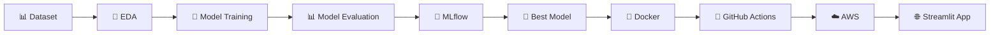
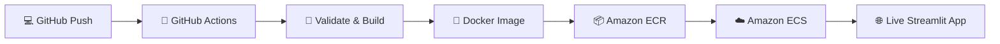
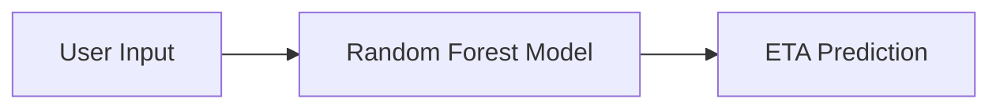

<div align="center">

# 🍔 Food Delivery ETA Prediction

### End-to-End Machine Learning & MLOps Project

Predicting food delivery time using Machine Learning, MLflow, Docker,
GitHub Actions and AWS.

<br>


<br>

**📊 Data → 🤖 ML → 🧪 MLflow → 🐳 Docker → 🔄 CI/CD → ☁️ AWS → 🌐 Streamlit**

</div>

---

## 📌 Project Overview

**Food Delivery ETA Prediction** is an end-to-end Machine Learning and
MLOps project that predicts the estimated delivery time of food orders.

The project demonstrates the complete journey of a Machine Learning model:

> **Data Understanding → EDA → Model Training → Evaluation → Experiment Tracking → Containerization → CI/CD → Cloud Deployment**

The final model is integrated into an interactive **Streamlit application**
and deployed on **Amazon ECS**.

> **Dataset Note:** This project uses a public historical food-delivery
> dataset. It is not live or real-time Zomato data.

---

## 🎯 Objective

The main objective is to build a Machine Learning model that can estimate
food delivery time based on delivery, location, traffic, weather,
vehicle and order-related information.

### 🎯 Target Variable

```text
Time_taken (min)
```
---

## 🔎 Exploratory Data Analysis

- 📊 Univariate Analysis
- 🔗 Bivariate Analysis
- 🧩 Multivariate Analysis
- 📈 Correlation Analysis
- 📍 Delivery Distance Analysis
- 🌦️ Weather vs Delivery Time
- 🛵 Vehicle Type vs Delivery Time
- 📦 Order Type vs Delivery Time
- 🏙️ City vs Delivery Time

### Key Insights

| Factor | Observation |
|:---|:---|
| ⭐ **Ratings** | Delivery ratings show a relationship with delivery time |
| 📦 **Multiple Deliveries** | Multiple deliveries tend to increase delivery duration |
| 🛵 **Vehicle Condition** | Vehicle condition shows a relationship with delivery time |
| 🚦 **Traffic** | Traffic conditions contribute to delivery-time variation |
| 🌦️ **Weather** | Weather conditions show differences in delivery duration |

---

## 🤖 Machine Learning 

The problem was formulated as a **Regression** task because the target
variable represents delivery time in minutes.

### Models Evaluated

| Model | MAE ↓ | RMSE ↓ | R² ↑ |
|:---|---:|---:|---:|
| Linear Regression | 4.961 | 6.262 | 0.555 |
| **Random Forest** 🏆 | **3.298** | **4.177** | **0.802** |

---

## 🏆 Best Model — Random Forest

After evaluating the models, **Random Forest Regression** was selected as
the best-performing model.

### Model Performance

<div align="center">

| Metric | Score |
|:---:|:---:|
| 🎯 **R² Score** | **0.802** |
| 📉 **MAE** | **3.298 min** |
| 📊 **RMSE** | **4.177 min** |

</div>

The trained model is stored at:
```text
models/best_model.pkl
```
---

## 🧪 Experiment Tracking with MLflow

**MLflow** is integrated into the project to track and manage the
Machine Learning lifecycle.

### MLflow Responsibilities

- 📈 Experiment Tracking
- 📝 Model Logging
- 🔢 Model Versioning
- 📦 Model Registry

### Registered Model

```text
Food_Delivery_ETA_Model
```
---
## ⚙️ MLOps Architecture

The project follows an end-to-end Machine Learning and MLOps workflow,
from raw data to a deployed prediction application.


## ☁️ CI/CD & AWS Deployment

GitHub Actions automates the validation, Docker image build, and deployment
process using Amazon ECR and Amazon ECS.



### AWS Services

| Service | Purpose |
|:---|:---|
| **Amazon ECR** | Docker image storage |
| **Amazon ECS** | Container deployment |
| **AWS IAM** | Secure authentication |
| **GitHub Actions** | CI/CD automation |

---

## 🖥️ Streamlit Application

The trained **Random Forest model** is integrated into a Streamlit
application for interactive delivery-time prediction.



## 🛠️ Tech Stack

| Category | Technologies |
|:---|:---|
| 🐍 Programming | Python |
| 📊 Data Analysis | Pandas, NumPy |
| 📈 Visualization | Matplotlib, Seaborn |
| 🤖 Machine Learning | Scikit-learn |
| 🧪 MLOps | MLflow |
| 🖥️ Application | Streamlit |
| 🐳 Containerization | Docker |
| 🔄 CI/CD | GitHub Actions |
| ☁️ Cloud | AWS ECR, AWS ECS |

---

## 💡 What This Project Demonstrates

- 🤖 End-to-end Machine Learning workflow
- 🧪 MLflow experiment tracking and model management
- 🐳 Docker containerization
- 🔄 CI/CD automation with GitHub Actions
- ☁️ AWS-based deployment using ECR and ECS
- 🖥️ Interactive ML application with Streamlit

---

## 🔮 Future Improvements

- Hyperparameter optimization
- Model monitoring
- Automated model retraining
- Data drift detection
- Cloud-based MLflow tracking

---

## 👩‍💻 Author

### Sona Kunwar

**Data Science & Machine Learning Enthusiast**

Building practical Machine Learning projects and exploring
production-ready MLOps workflows.

⭐ **If you found this project useful, consider giving it a star!**
